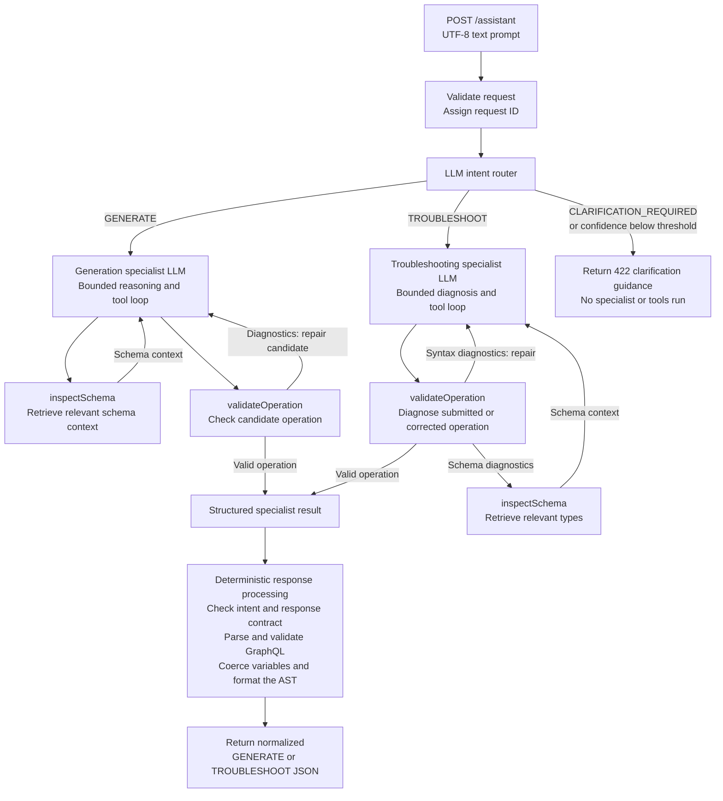

# GraphQL Assistant

GraphQL Assistant combines LLM agents with deterministic GraphQL tooling. Its
single `/assistant` endpoint supports two workflows:

- generate a named, schema-valid GraphQL query or mutation from natural language
- troubleshoot a submitted operation and return diagnoses plus a validated
  correction

The application uses local Ollama `qwen3:8b` by default and can use OpenAI
instead.

## AI Concepts Covered

- **Intent routing:** classifies each prompt as generation, troubleshooting, or
  clarification required.
- **Specialist agents:** runs only the agent responsible for the selected
  workflow.
- **Tool calling:** lets specialists inspect schema types and validate candidate
  operations through bounded, read-only functions.
- **Schema-grounded retrieval:** retrieves compact GraphQL context on demand,
  providing a RAG-style pattern without embeddings or a vector database.
- **Prompt engineering:** uses separate system instructions for routing,
  generation, and troubleshooting.
- **Structured output:** converts model-produced JSON into typed domain records
  before business processing.
- **Guardrails:** validates prompt boundaries, tool inputs, GraphQL syntax,
  schema compatibility, variable shapes, and final response contracts.
- **Provider abstraction:** runs the same agent workflow with local Ollama or
  hosted OpenAI inference.
- **Observability:** correlates routing, inference, tools, latency, and outcomes
  with a request ID while keeping full-content logging opt-in.
- **AI evaluation:** combines deterministic transcript-based cases with
  optional live-model quality and latency measurements.

## How it works



## Documentation

This README is the practical setup, usage, and contribution guide. The
authoritative product requirements and boundaries live elsewhere:

| Document | Purpose |
| --- | --- |
| [SPEC.md](SPEC.md) | Approved requirements, API contracts, architecture, security boundaries, and scope |
| [EVALS.md](EVALS.md) | Evaluation datasets, commands, thresholds, reports, and failure analysis |
| [READINESS.md](READINESS.md) | Recorded release verification, live measurements, known risks, and rollback |
| [tasks/plan.md](tasks/plan.md) | Approved implementation plan and acceptance criteria |
| [tasks/todo.md](tasks/todo.md) | Implementation task completion status |

When documentation differs, `SPEC.md` is authoritative for product behavior.
Update and approve the specification before implementing a scope or contract
change. Editing documentation alone does not alter runtime behavior, but an
incorrect specification can misdirect future implementation and review.

## Requirements

- Java 21
- The included Maven Wrapper (`./mvnw`); a separate Maven installation is not
  required
- One AI provider:
  - [Ollama](https://docs.ollama.com/quickstart) with `qwen3:8b` by default, or
  - an OpenAI API key

Confirm the active JDK:

```bash
java -version
```

The output must report Java 21.

## Quick start with Ollama

Clone the repository and enter the project directory:

```bash
git clone https://github.com/skp2001vn/graphql-assistant2.git
cd graphql-assistant2
```

Install Ollama, then make the default model available:

```bash
ollama pull qwen3:8b
ollama ls
```

Ollama normally starts its local service automatically. If it does not, run
`ollama serve` in a separate terminal. The default endpoint is
`http://localhost:11434`.

Start GraphQL Assistant from the repository root:

```bash
./mvnw spring-boot:run
```

Startup validates the configured GraphQL schema but does not contact the model.
In another terminal, confirm readiness:

```bash
curl http://localhost:8080/health
```

Expected response:

```json
{"status":"UP"}
```

Generate a GraphQL operation:

```bash
curl -X POST http://localhost:8080/assistant \
  -H 'Content-Type: text/plain; charset=UTF-8' \
  --data 'Generate a query that lists country codes and names.'
```

Example response:

```json
{
  "intent": "GENERATE",
  "query": [
    "query ListCountries {",
    "  countries {",
    "    code",
    "    name",
    "  }",
    "}"
  ],
  "variables": {}
}
```

## Configure the GraphQL schema

The default schema is
[`src/main/resources/schema.graphql`](src/main/resources/schema.graphql).
Replace it with the SDL schema the assistant should use, or point to an
external resource:

```bash
export ASSISTANT_SCHEMA_LOCATION=file:/absolute/path/to/schema.graphql
./mvnw spring-boot:run
```

The application loads exactly one schema at startup. Restart after changing
it. Startup fails when the resource is missing, unreadable, empty, or invalid
SDL, which prevents the AI workflow from running without reliable schema
grounding.

Schema inspection is targeted rather than embedding-based: the specialist asks
for relevant root operations and named types through a read-only tool. There is
no vector store, schema upload endpoint, per-request schema selection, or
multi-schema merge.

## Configuration

Spring Boot reads environment variables directly. If you prefer a local file,
copy the example and export it before starting:

```bash
cp .env.example .env
set -a
source .env
set +a
./mvnw spring-boot:run
```

Spring Boot does not load `.env` automatically. The file is ignored by Git;
never commit real API keys.

| Environment variable | Default | Purpose |
| --- | --- | --- |
| `ASSISTANT_AI_PROVIDER` | `ollama` | Select `ollama` or `openai` at startup |
| `ASSISTANT_AI_REQUEST_TIMEOUT` | `60s` | Hard end-to-end assistant workflow timeout |
| `ASSISTANT_AI_WARM_RESPONSE_TARGET` | `30s` | Operational warm-response target |
| `ASSISTANT_AI_OLLAMA_BASE_URL` | `http://localhost:11434` | Ollama API base URL |
| `ASSISTANT_AI_OLLAMA_MODEL` | `qwen3:8b` | Ollama model tag |
| `OPENAI_API_KEY` | empty | Required when `ASSISTANT_AI_PROVIDER=openai` |
| `ASSISTANT_AI_OPENAI_MODEL` | `gpt-5.4-mini` | OpenAI model identifier |
| `ASSISTANT_SCHEMA_LOCATION` | `classpath:schema.graphql` | Spring resource location for GraphQL SDL |
| `ASSISTANT_LOGGING_FULL_CONTENT_ENABLED` | `false` | Opt in to complete AI workflow content in structured logs |

Configuration is validated at startup. There is no automatic provider
fallback, retry, or per-request model override.

### Use OpenAI

Set the provider, key, and optional model:

```bash
export ASSISTANT_AI_PROVIDER=openai
export OPENAI_API_KEY=replace-with-your-openai-api-key
export ASSISTANT_AI_OPENAI_MODEL=gpt-5.4-mini
./mvnw spring-boot:run
```

The application fails at startup when OpenAI is selected without a nonblank
key. It does not silently fall back to Ollama.

### Run the packaged JAR

Build and run the executable artifact:

```bash
./mvnw clean package
java -jar target/graphql-assistant-0.0.1-SNAPSHOT.jar
```

The same environment variables apply to both Maven and packaged-JAR startup.

## API

The server binds to `127.0.0.1:8080` by default.

| Method | Path | Purpose |
| --- | --- | --- |
| `POST` | `/assistant` | Generate or troubleshoot one GraphQL operation |
| `GET` | `/health` | Confirm startup and schema loading completed |
| `GET` | `/v3/api-docs` | Retrieve the OpenAPI document |
| `GET` | `/swagger-ui.html` | Open interactive API documentation |

### Request contract

`POST /assistant` accepts:

- `Content-Type: text/plain; charset=UTF-8`
- a nonblank natural-language prompt
- a maximum body size of 100 KB

Each request is independent. The API does not retain chat history or infer
context from an earlier request.

### Generate an operation

```bash
curl -X POST http://localhost:8080/assistant \
  -H 'Content-Type: text/plain; charset=UTF-8' \
  --data 'Generate a query for country CA with its code and name.'
```

The response uses the `GENERATE` intent and returns:

- `query`: a named, schema-valid operation represented as lines
- `variables`: runtime values keyed without the GraphQL `$` prefix

When the prompt omits a required value, the assistant can return a realistic,
type-compatible example such as `"CA"` for a code. The operation remains a
sample: the service does not execute it.

### Troubleshoot an operation

```bash
curl -X POST http://localhost:8080/assistant \
  -H 'Content-Type: text/plain; charset=UTF-8' \
  --data 'Fix this query: query ListCountries { countries { title } }'
```

Example response:

```json
{
  "intent": "TROUBLESHOOT",
  "issues": [
    {
      "issue": "Unknown field",
      "details": "The schema defines 'name', not 'title'.",
      "suggestion": "Replace 'title' with 'name'."
    }
  ],
  "correctedQuery": [
    "query ListCountries {",
    "  countries {",
    "    name",
    "  }",
    "}"
  ],
  "variables": {}
}
```

The response uses the `TROUBLESHOOT` intent and returns:

- `issues`: model-produced diagnoses and repair guidance
- `correctedQuery`: the complete corrected operation after deterministic
  validation
- `variables`: runtime values for declared GraphQL variables

### Errors

Handled errors use a stable JSON envelope and include the request ID returned
in the `X-Request-ID` response header:

```json
{
  "timestamp": "2026-06-18T15:00:00Z",
  "requestId": "8cd91a0b-93c2-4e9a-9dce-f7eed67f52a5",
  "status": 422,
  "code": "CLARIFICATION_REQUIRED",
  "message": "Specify what operation you want to generate or include the operation to troubleshoot.",
  "details": []
}
```

| Status | Code | Meaning |
| ---: | --- | --- |
| `400` | `INVALID_REQUEST` | Body is empty, malformed, unreadable, or not valid UTF-8 |
| `413` | `REQUEST_TOO_LARGE` | Body exceeds 100 KB |
| `415` | `UNSUPPORTED_MEDIA_TYPE` | Request is not UTF-8 `text/plain` |
| `422` | `CLARIFICATION_REQUIRED` | Prompt is ambiguous or lacks enough context |
| `500` | `INTERNAL_ERROR` | Unexpected application failure |
| `502` | `AI_PROVIDER_ERROR` | Provider request or bounded workflow timed out |
| `502` | `INVALID_AI_RESPONSE` | Model output violated the structured or GraphQL contract |
| `502` | `AGENT_EXECUTION_ERROR` | Router, specialist, or bounded tool workflow failed safely |

See [SPEC.md](SPEC.md) and the live OpenAPI document for the complete normative
contract.

## Security and privacy

This project is designed for local development, not public deployment.

- The prompt is untrusted and cannot override agent system instructions.
- Generated operations are validated but never executed.
- Model tools are read-only and bounded.
- The application has no database or chat-history persistence. Structured logs
  may retain request and schema content according to your logging configuration.
- API keys are not written into OpenAPI examples or normal response payloads.
- Configured provider credentials are redacted if they appear in logged
  content.
- Full-content logs can still contain other secrets embedded in prompts,
  schemas, operations, variables, or model output.
- OpenAI receives request and schema-derived content when selected.
- Ollama keeps inference local only when the configured Ollama endpoint is
  local and under your control.

Full-content logging is disabled by default. Enable it only when the complete
AI workflow is safe to retain:

```bash
export ASSISTANT_LOGGING_FULL_CONTENT_ENABLED=true
```

Authentication, authorization, TLS termination, rate limiting, production
network hardening, persistence, and GraphQL execution are outside the approved
scope. See [SPEC.md](SPEC.md) for the complete boundary.

## Observability

The application emits structured JSON logs for:

- request start and completion
- request ID, selected agent, status, latency, and error category
- selected provider and model
- router selection
- model response completion
- tool name, outcome, and duration
- normalized response completion

When full-content logging is enabled, the same events can include schema,
prompt, raw model response, tool input/output, and final response content. Use
the `X-Request-ID` header or error `requestId` to correlate a request across the
workflow.

## Development

### Common commands

| Command | Purpose |
| --- | --- |
| `./mvnw spring-boot:run` | Start the local API |
| `./mvnw test` | Run the offline automated tests |
| `./mvnw test -Pevals` | Run deterministic evaluation datasets |
| `./mvnw test -Pevals-live` | Run live Ollama evaluations |
| `./mvnw test -Pevals-live -Deval.case=<id>` | Run one live evaluation case |
| `./mvnw checkstyle:check` | Run static style checks |
| `./mvnw spotless:check` | Check Java formatting |
| `./mvnw spotless:apply` | Apply Java formatting |
| `./mvnw javadoc:javadoc` | Generate API documentation |
| `./mvnw verify` | Run the complete offline release gate |
| `./mvnw clean package` | Run tests and build the executable JAR |

Live evaluations require a reachable Ollama service and model. Normal tests and
`./mvnw verify` do not require Ollama or OpenAI.

### Project structure

```text
src/main/java/com/example/graphqlassistant/
  agent/       routing, specialist prompts, orchestration, structured output
  api/         HTTP endpoints, response contracts, request IDs, error mapping
  assistant/   application service and response normalization
  config/      Spring composition, provider selection, external properties
  logging/     request-scoped AI workflow observability
  provider/    provider-neutral LangChain4j model adapter
  schema/      schema loading and deterministic operation processing
  tools/       schema inspection, validation, diagnostics, formatting

src/main/resources/
  application.yml
  schema.graphql

src/test/
  Java tests and deterministic/live evaluation datasets
```

### Evaluation workflow

Use deterministic evaluations for every behavior, prompt, routing, or
tool-contract change:

```bash
./mvnw test -Pevals
```

Use live Ollama evaluations when model quality or latency may have changed:

```bash
./mvnw test -Pevals-live
```

Reports are written under `target/evals/`. See [EVALS.md](EVALS.md) for dataset
format, thresholds, focused debugging, and failure interpretation.

### Changing behavior

`SPEC.md` is the implementation foundation. A behavior change should follow
this order:

1. update the relevant requirement, API contract, boundary, or success
   criterion in `SPEC.md`;
2. obtain explicit approval for the specification change;
3. update `tasks/plan.md` when implementation work or acceptance criteria
   change;
4. implement the smallest approved change;
5. add or update tests and evaluations;
6. run the applicable verification gates;
7. update this README only where setup or usage changed.

README improvements do not replace specification approval.

## Troubleshooting

### Java reports another version

Set `JAVA_HOME` to a Java 21 JDK and reopen the terminal:

```bash
java -version
```

### Schema startup failure

Verify `ASSISTANT_SCHEMA_LOCATION`. For an external file, use a Spring file URI
such as:

```bash
export ASSISTANT_SCHEMA_LOCATION=file:/absolute/path/to/schema.graphql
```

Confirm the file is readable, nonempty, and valid GraphQL SDL.

### Ollama returns `502 AI_PROVIDER_ERROR`

Check the model and local endpoint:

```bash
ollama ls
curl http://localhost:11434/api/tags
```

Run `ollama serve` if the local service is not already running.

### OpenAI startup fails

Set both values before startup:

```bash
export ASSISTANT_AI_PROVIDER=openai
export OPENAI_API_KEY=replace-with-your-openai-api-key
```

### API returns `415`

Send a plain UTF-8 body, not JSON:

```bash
-H 'Content-Type: text/plain; charset=UTF-8'
```

### API returns `422`

State whether you want generation or troubleshooting. For troubleshooting,
include the complete GraphQL operation. A `422` is an intentional clarification
response, not an internal failure.

### Enable full-content debugging logs

Opt in only when schemas, prompts, operations, variables, model responses, and
tool payloads are safe to retain:

```bash
export ASSISTANT_LOGGING_FULL_CONTENT_ENABLED=true
```

### A request failed with an ID

Search structured logs for the response `X-Request-ID` header or error
`requestId`. The identifier correlates routing, inference, tools, normalization,
status, latency, and error category.

## Scope

The initial release intentionally excludes operation execution, authentication,
authorization, persistence, chat history, streaming, per-request schemas,
multi-schema support, a web UI, Docker/cloud deployment, automatic provider
fallback, and unbounded autonomous agents.

For the authoritative and complete scope, see [SPEC.md](SPEC.md).
